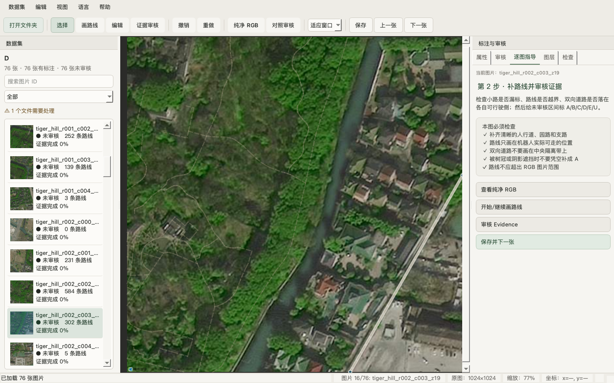
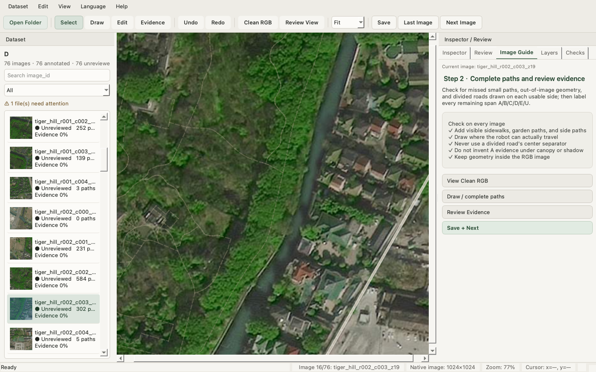

<div align="center">

# 高德卫星地图采集与路径标注工具

**面向研究团队的卫星影像采集、路径标注与模型验证工作流**


[快速开始](#最短使用流程) · [安装](#2-安装) · [地图采集](#5-正式地图采集规范) · [开始标注](#10-启动标注器) · [标注规范](#12-到底标什么) · [导出验证](#25-导出给模型做验证) · [常见问题](#28-常见问题)

</div>

---

这是一个给研究团队使用的小型工具，用来完成两件事：

1. 按统一规格批量采集校园、园区或公园的高德卫星图；
2. 在普通 RGB 图或连续地图上人工绘制机器人可通行的完整 Path Polyline，并审核每一段路线的视觉依据。

它不是道路分割工具，也不会自动判断哪里能走。V2 保存的核心真值是人工确认的 **Path Polyline**；path type 和局部 evidence 是两个独立维度。旧版 Region Graph JSON 仍能打开，但会安全地另存为 schema v2，不会覆盖旧文件。后续的 mask、centerline 或路径规划输入应从这份标注自动生成，不要让标注员重复维护多份 GT。

> 当前正式数据规格：高德 Satellite、Zoom 19、1024×1024、15% overlap。

## 界面预览

| 中文逐图指导 | English interface |
|---|---|
|  |  |

标注器支持中英文即时切换、Mac 触控板与鼠标缩放/平移、逐图操作指导、Clean RGB、Evidence 审核和保存后自动进入下一张。

## 最短使用流程

### 最省事的启动方式（推荐）

不需要打开终端，也不需要手动激活虚拟环境：

- **macOS**：双击项目里的 `AMap Path Annotator.app`；
- **Windows**：双击 `scripts\run_annotator_easy.vbs`。

第一次打开时，启动器会自动创建项目环境并安装依赖。以后继续双击即可。电脑需要预先安装 **Python 3.12**；如果系统没有 Python，启动器会弹窗说明。启动后点击 **打开文件夹 / Open Folder**，选择要标注的 `A/rgb`、`B/rgb`、`C/rgb` 或 `D/rgb` 文件夹。

如果 macOS 第一次拦截未签名应用，请右键应用选择 **打开**，确认一次即可。启动器不会修改系统 Python，也不会要求你手动执行 `source .venv/bin/activate`。

普通标注员第一次使用：

```text
安装 Python 3.12
→ 双击 AMap Path Annotator.app（macOS）或 run_annotator_easy.vbs（Windows）
→ 等待首次自动准备环境
→ 点 Open Folder 选择图片文件夹
```

地图采集或需要手动维护开发环境时，再按下面的命令行安装说明操作。

采一个区域：

```text
确定 BBOX
→ plan_region.py 查看图片数量
→ capture_region.py 正式采图
→ check_region.py 检查完整性
→ make_preview.py 看整区预览
→ 检查通过后再开始标注
```

人工标注：

```text
launch_annotator.py
→ Open Folder
→ P 画路线 / V 编辑
→ X 进入 Evidence，拖选局部路线后按 A/B/C/D/E/U
→ Cmd/Ctrl + Enter 保存并切到下一张
```

最简单的启动命令不需要任何参数：

```bash
python scripts/launch_annotator.py
```

启动后点 **Open Folder**，选择普通图片文件夹即可。程序会自动扫描 PNG、JPEG、TIFF 和 WebP，识别已有同名 JSON，并打开第一张未审核图片；只有图片也能直接开始标，第一次保存时才建立 `annotations_v2/`。详细说明见 [docs/ANNOTATION_TOOL_V2.md](docs/ANNOTATION_TOOL_V2.md)。

标注器默认显示中文。顶部 **语言** 菜单可即时切换为 English，并会记住选择。主要按钮悬停满 3 秒会显示用途说明；右侧 **逐图指导** 会根据当前图片状态告诉你下一步。团队统一规则见 [每张图片的中英文标注指导](docs/ANNOTATION_GUIDE_BILINGUAL.md)。

## 1. 环境要求

- Python 3.12.x
- macOS Apple Silicon，或 Windows 10/11 x64
- Google Chrome；Windows 也可以使用 Microsoft Edge
- 有效的高德地图 JS API Key
- 能访问高德地图服务的网络

不建议使用 Python 3.14。本项目在 macOS 上遇到过 Python 3.14 与 PySide6 Cocoa plugin 不兼容的问题，目前统一使用 Python 3.12。

## 2. 安装

### macOS

已经下载并安装 Python 3.12 的同事，直接双击项目根目录的 **AMap Path Annotator.app** 即可。下面的命令行安装方式只适合需要自己维护开发环境的人。

```bash
git clone https://github.com/Yangbadger222/gaode-tools.git
cd gaode-tools
python3.12 -m venv .venv
source .venv/bin/activate
python -m pip install --upgrade pip
pip install -r requirements-dev.txt
```

### Windows PowerShell

日常标注不需要打开 PowerShell，直接双击 `scripts\run_annotator_easy.vbs` 即可。下面的 PowerShell 步骤是手动安装或排查问题时使用的备用方式。

先安装 Python 3.12 x64，然后执行：

```powershell
git clone https://github.com/Yangbadger222/gaode-tools.git
cd gaode-tools
py -3.12 -m venv .venv
.\.venv\Scripts\Activate.ps1
python -m pip install --upgrade pip
pip install -r requirements-dev.txt
```

如果 PowerShell 禁止运行激活脚本，可以由用户自行执行：

```powershell
Set-ExecutionPolicy -Scope CurrentUser RemoteSigned
```

项目不会自动修改 Execution Policy。也可以运行 `.\scripts\setup_windows.ps1`。Windows 代码兼容已经完成，但仍需真机验收，步骤见 [WINDOWS_TEST_CHECKLIST.md](WINDOWS_TEST_CHECKLIST.md)。

安装完成后，Windows 可以直接双击：

```text
scripts\run_annotator_windows.cmd
```

`run_annotator_easy.vbs` 是更省事的入口：它会自动准备 `.venv` 和依赖，并隐藏命令行窗口。`run_annotator_windows.cmd` 保留给需要看到启动日志的排查场景。

或在 PowerShell 中运行：

```powershell
.\scripts\run_annotator.ps1
.\scripts\run_annotator.ps1 -Folder "D:\dataset\rgb"
.\scripts\run_annotator.ps1 -Language en
```

脚本会从自己的位置找到项目根目录，因此不要求 PowerShell 当前正好位于仓库目录。若虚拟环境不存在，它会明确提示先运行 `setup_windows.ps1`。

## 3. 配置高德 API Key

macOS：

```bash
cp .env.example .env
```

Windows：

```powershell
Copy-Item .env.example .env
```

编辑 `.env`：

```ini
AMAP_JS_API_KEY=在这里填写你的Key
```

如果高德应用配置了安全密钥，再填写：

```ini
AMAP_JS_SECURITY_CODE=在这里填写安全密钥
```

不要把 Key 写进源码、发到群里或提交到 Git。程序诊断只显示 Key 是否已配置，不会打印实际内容。`.env` 已在 `.gitignore` 中。

程序会自动寻找浏览器：macOS 优先 Chrome；Windows 优先 Chrome，其次 Edge。如果自动检测失败，可以在 `.env` 设置：

```ini
AMAP_BROWSER_EXECUTABLE=浏览器可执行文件路径
```

## 4. 先运行环境诊断

```bash
python scripts/diagnose_environment.py
```

正常输出应包含：

```text
Python: 3.12.x
PySide6: 6.11.2
Platform plugin: ... YES
Browser: Google Chrome 或 Microsoft Edge
Playwright: YES
AMAP key configured: YES
```

## 5. 正式地图采集规范

### 数据源

统一使用高德地图 JS API 的 Satellite 卫星图层。不要直接抓高德内部瓦片 URL，也不要移除高德要求保留的 logo 和版权 attribution。

### 正式参数

```text
Zoom: 19
Image size: 1024 × 1024
Overlap: 15%
```

同一批正式数据不要混用 Z18、Z19 和 Z20。不同 zoom 的比较应单独做验证实验。

### Region 和 BBOX

不要一张一张手工截图。以一个完整校园、园区或公园作为一个 Region，例如 `campus_001`、`campus_002`、`park_001`。

每个 Region 输入四个边界：

```text
west   最西经度
south  最南纬度
east   最东经度
north  最北纬度
```

程序会在 Web Mercator 像素空间生成固定网格。所有 tile 大小、间距和 overlap 必须一致。为了保持规则网格，最右边和最下面允许比输入 BBOX 多采一点；不要人为移动或裁剪最后一行、最后一列。

## 6. 采集前先生成计划

不要输入 BBOX 后直接抓图。先看会生成多少张：

```bash
python scripts/plan_region.py \
  --west 120.740 --south 31.274 \
  --east 120.746 --north 31.280 \
  --zoom 19 --width 1024 --height 1024 --overlap 0.15 \
  --region_id campus_001 \
  --out_dir outputs/campus_001
```

Windows PowerShell 可以写成一行：

```powershell
python scripts\plan_region.py --west 120.740 --south 31.274 --east 120.746 --north 31.280 --zoom 19 --width 1024 --height 1024 --overlap 0.15 --region_id campus_001 --out_dir outputs\campus_001
```

程序会显示 rows、cols、总图片数、requested BBOX 和实际覆盖范围，并生成 `collection_plan.json`。超过默认安全阈值时会询问是否继续，自动化运行可以显式加 `--yes`。

## 7. 正式采集与断点续传

```bash
python scripts/capture_region.py \
  --west 120.740 --south 31.274 \
  --east 120.746 --north 31.280 \
  --zoom 19 --overlap 0.15 \
  --region_id campus_001 \
  --out_dir outputs/campus_001 \
  --resume
```

`--resume` 很重要。采集中途网络失败、终端关闭或按 Ctrl+C 后，重新执行同一条命令即可继续。

文件命名固定为：

```text
{region_id}_r{row}_c{col}_z{zoom}.png
```

例如 `campus_001_r000_c001_z19.png`。不要手工改名，否则 row/col 邻接关系会失效。

## 8. 采完必须检查

### 完整性检查

```bash
python scripts/check_region.py --region outputs/campus_001/region.json
```

至少应满足：

```text
Missing: 0
Invalid PNG: 0
Wrong dimensions: 0
Duplicate IDs: 0
所有 horizontal overlap: 0.1500 PASS
所有 vertical overlap: 0.1500 PASS
```

出现 FAIL 时不要开始标注。先重新运行 `capture_region.py --resume`。

### 整区预览

```bash
python scripts/make_preview.py --region outputs/campus_001/region.json
```

会生成：

```text
preview_mosaic.jpg  整区预览
preview_grid.jpg    带 row/col 的定位图
```

Preview 只用于检查，不是训练原图。请人工检查：

- 有没有黑块或没加载完的图；
- 有没有重复上一位置的旧图；
- 道路和建筑跨 tile 是否连续；
- 有没有某一行或某一列整体错位；
- 最后一行、最后一列是否异常重复。

全部正常后，这个 Region 才能开始标注。

## 9. Region 输出

```text
outputs/campus_001/
├── campus_001_r000_c000_z19.png
├── campus_001_r000_c001_z19.png
├── ...
├── collection_plan.json
├── metadata.csv
├── region.json
├── failed_tiles.json       # 只有失败时才有
├── preview_mosaic.jpg
└── preview_grid.jpg
```

`region.json` 记录 row、col、中心经纬度、地理范围和 `global_x/global_y`。标注器用这些信息恢复连续地图。新数据使用便携相对路径；旧 absolute/project-relative 路径仍兼容。

## 10. 启动标注器

推荐方式（macOS / Windows 都一样）：

```bash
python scripts/launch_annotator.py
```

也可以从终端直接打开某个普通文件夹：

```bash
python scripts/launch_annotator.py --folder /path/to/dataset
```

界面支持下面几种常见目录，不要求 manifest 或 config：

```text
dataset/img001.png
dataset/img001.png + dataset/img001.json
dataset/rgb/img001.png + dataset/annotations/img001.json
dataset/tiger_hill/... + dataset/tongli/...
```

原图始终只读。只有图片时保存到 `dataset/annotations_v2/`；读取旧 schema 1.x 时也写到 `annotations_v2/`，原 JSON 不覆盖；schema v2 才会原位原子保存并保留 `.bak`。

旧 Region 工作流仍可使用：

```bash
python scripts/launch_annotator.py --region outputs/campus_001/region.json
```

使用团队已分配的标注工作区时，用下面的命令启动。窗口会显示例如 `区域 1/4（共 76 张图）`：前一个数字是分配的连续区域数，括号内才是该标注员真正需要看的 PNG 图块总数。它提供清晰的 **上一张**、**下一张** 按钮；切换时会自动保存当前标注。

```bash
python scripts/launch_annotation_queue.py \
  --workspace outputs/suzhou_rgb_satellite_dataset_300/annotation_workspace \
  --scheme 4_people \
  --annotator D
```

要从某个指定区域开始，把 `--region tiger_hill` 加在命令末尾。这个队列只包含该标注员被分配的区域，不会跳到其他人的文件。

## 11. 标注器怎么用

界面可在 **语言 / Language** 菜单中切换中英文。右侧 **逐图指导 / Image Guide** 是每张图的工作清单：先看纯净 RGB，再补路线和修 geometry，随后审核 Evidence，完成后保存并进入下一张。详细逐图规则见 [docs/ANNOTATION_GUIDE_BILINGUAL.md](docs/ANNOTATION_GUIDE_BILINGUAL.md)。

| 操作 | 方法 |
|---|---|
| 打开图片文件夹 | Open Folder 或 `Cmd/Ctrl + O` |
| 选择 / 编辑 | `V` 或 Select；拖控制点可修改 |
| 画路径 | `P` 或 Draw Path |
| 加控制点 | 左键逐点点击 |
| 完成路径 | 双击或 `Enter`；`Backspace` 撤回当前最后一点；`Esc` 取消 |
| 缩放 | 鼠标滚轮；Mac 触控板双指捏合 |
| 平移 | `Space + 拖动`、鼠标中键拖动、Mac 触控板双指滑动 |
| 固定缩放 | `F` 适应图片；`1/2/4/8` 为 100%/200%/400%/800% |
| Clean RGB | 反引号 `` ` ``，只显示原始 RGB，再按一次恢复 |
| Evidence | `X`，可沿路线拖选，或先点起点再点终点选择范围，然后按 `A/B/C/D/E/U` |
| Review View | `R`，左右同步显示 Clean RGB 和标注图 |
| 上一张 / 下一张 | `←/→` 或明确的 Last Image / Next Image 按钮 |
| 下一个未审核 span | Evidence/Review 中 `N`；`Shift+N` 返回上一个 |
| 插入控制点 | 双击路线 segment，或右键 Insert Point Here |
| 精细移动点 | 方向键 1 native px；`Shift + 方向键` 5 px |
| 删除对象 | `Delete` / `Backspace` |
| 保存 | Cmd/Ctrl + S |
| 保存并下一张 | Cmd/Ctrl + Enter |
| 撤销 | Cmd/Ctrl + Z |
| 重做 | Cmd/Ctrl + Shift + Z |
| 隐藏左右面板 | `Tab` / `Shift+Tab` |
| 查看快捷键 | `?` |

把鼠标停在顶部主要按钮或逐图指导按钮上满 3 秒，会出现一段不依赖专业术语的用途说明；鼠标移开、点击按钮或窗口隐藏时提示会立即关闭。

Evidence 六类：`A Clear`、`B Weak Visual`、`C Context Only`、`D Draft Misaligned`、`E Task Mismatch`、`U Unsure`。最关键的判断是：B 仍必须能指出具体 RGB 像素证据；C 主要依靠布局或常识推断。低分辨率不自动等于 B。旧路线绝不会自动标成 A。

审核时的颜色提示：琥珀色虚线表示未审核；绿色 / 橙色 / 紫色 / 红色 / 灰色 / 蓝灰色分别对应 A / B / C / D / E / U。右侧“审核”面板也会显示同一份颜色图例。单击只设置起点，不会自动生成一小段。

局部 E 只排除选中的路线区间，不会排除整条 polyline。只有明确使用右键或属性中的 **排除整条路径 / Exclude Entire Path** 才会进入 `excluded_edges`；整条路径会显示为灰色，并可恢复、撤销和重做。历史上同时存在局部 E 与整路标志的旧数据会被报告为歧义，不会静默猜测。

B 可选记录 `visibility_issue`：`tree_canopy`、`shadow`、`low_contrast`、`low_resolution`、`narrow_structure`、`building_occlusion`、`mixed`、`other`。不选也可以保存；改成其他 Evidence 类别时会自动清除。低分辨率本身不是 B 的理由，仍要能指出具体 RGB 证据。

程序每次操作后约 0.9 秒自动保存；状态栏显示 Saved 或 Save Failed。Folder 设置可开启 **Read Only / Sealed**，此时只能查看，不能修改、保存或批量覆盖。schema 细节见 [docs/ANNOTATION_SCHEMA_V2.md](docs/ANNOTATION_SCHEMA_V2.md)。

## 12. 到底标什么

只标明确存在、可以长期用于校园或园区地面机器人导航的固定路径网络。

标：校园主路、园区车道、普通人行道、公园步道、真实存在的窄通道，以及后勤维护道路。

通常不标：

- 草坪；
- 空地或开放广场中“理论上能走”的区域；
- 停车位或车辆之间的空隙；
- 建筑内部；
- 临时土路、施工便道；
- 只因为地面看起来空旷而猜测可通行的区域。

一句话：标的是**固定路径网络**，不是“所有可能走得过去的地方”。

## 13. Canonical Navigable Corridor Centerline

标注的是**稳定可导航通道的标准中心线，而不是某次机器人实际轨迹**。它不是 OSM 原始几何，也不是道路边界：

```text
单一人行道 / 园路 / 窄巷：沿 corridor 的视觉中心画一条路径

无实体分隔的普通窄道路：作为一个连续 corridor，只画一条中心线

有中央绿化带 / 护栏 / 隔离岛：两侧是两个 corridor，各画一条
             不沿中央绿化带、隔离栏、黄线或车道分界线画
```

宽广且没有固定通行主轴的广场、开放铺装区或大型停车区域，不要凭感觉画“机器人可能走”的线，只标明确 walkway/corridor。有实体中央隔离时，两侧只在真实路口、开口或斑马线连接。弯路应跟随 corridor 曲率，不能只点起终点拉直线。

清晰可见、长期存在的人行道、公园园路、建筑间铺装小路和服务通道都要补进来，不能因为 OSM 草稿没有就漏掉。反过来，树冠或阴影下无法确认 geometry 的路，不要凭想象续画，应该用 C/U/Ignore 逻辑标出。

## 14. Path Type

### `vehicle_road`

机动车正常通行的道路，例如校园主路、园区车道、停车场连接道路。只要本质是车道，即使机器人也能走，仍标 `vehicle_road`。

### `pedestrian_path`

正常宽度的人行路，例如校园人行道、公园步道和普通铺装小路。

### `narrow_path`

相对于周围正常人行路明显更窄，但确实长期存在的固定路径，例如建筑间窄通道。不要仅因为卫星图上“看起来细”就判为 narrow。

### `service_path`

主要供后勤、维修和设备维护使用的辅助道路。如果难以区分 `vehicle_road` 和 `service_path`，先记录问题，不要自行增加类别。

## 15. Node

- `junction`：两条或多条路径在现实中真正连通；连接 edge 必须共享同一个 node ID。
- `endpoint`：路径在现实中真的结束，例如死胡同或步道物理终点。
- `boundary`：路径没有结束，只是离开当前 Region。

二维图上相交不一定是 junction。桥上和桥下如果现实中不能互相进入，就不能连接。

## 16. Visibility 与遮挡

- `visible`：路径主体基本看清；
- `partially_occluded`：部分被树冠、阴影或建筑遮挡，但仍有明显证据；
- `fully_occluded`：目标卫星图中基本看不见，但有充分证据确认道路存在。

树冠遮挡不等于 endpoint。如果确认树下道路连续，graph 必须保持连通。

```text
fully_occluded = 确认有路，只是看不到
Ignore          = 连有没有路都无法确定
```

## 17. Verification Source

| 值 | 含义 |
|---|---|
| `rgb_context` | 根据当前卫星图前后关系确认 |
| `field_check` | 现场确认过 |
| `ground_photo` | 有地面照片 |
| `RTK` | 有真实 RTK 轨迹 |
| `campus_map` | 有可靠校园/园区地图 |
| `secondary_image` | 有其他时间或来源影像 |
| `none` | 普通可见路径没有额外证据 |

`fully_occluded` 最好不要填写 `none`。

## 18. Confidence

- `high`：位置、连接和类型都明确；
- `medium`：确认有路，但中心、类型或遮挡边界略有不确定；
- `low`：确认道路存在，但几何位置难以确定。

连有没有路都不知道时不要用 `low`，直接画 Ignore。

## 19. Split 和 Merge

以下情况应该 Split：真实 junction、path type 变化、`visible → fully_occluded → visible` 等重要可见性变化。Split 后两段必须共享同一个 node。

软件里的 Split 默认生成 `continuation` 节点。它表示“只是把一条连续的路切成几段”，例如 `visible → fully_occluded` 的分段点，不是真实路口。只有确认存在路径分叉或汇合时，才在 Properties 中把该节点改成 `junction`。不要把所有 Split 都当成路口。

不要因为每一棵小树或零碎阴影都切分。如果遮挡不影响道路连续性判断，可以保留同一条 edge。

两条分别画出的路径如果现实中确实连接，需要手工 Merge。两个 endpoint 很近不代表它们一定连通，软件只提示，不会自动合并。

## 20. Ignore Region

只有在人也无法从现有证据判断路径是否存在时使用，例如大片树冠、严重阴影、建筑完全遮挡或图像质量过差。

Ignore 表示“这里 GT 不确定”，不是“这里不能通行”。能够确认的部分仍正常标注。

## 21. 推荐标注顺序

1. 缩小地图，整体看一遍；
2. 先画明显主路；
3. 再画普通人行路；
4. 补窄路和 service path；
5. 处理所有 junction；
6. 处理树冠和建筑遮挡下确认连续的道路；
7. 实在无法判断的区域画 Ignore；
8. Run Checks；
9. 查看 Warnings 和 Statistics；
10. Save；
11. 关闭后重新打开，确认数据完整。

## 22. Warnings 怎么处理

Warnings 只提示，不会自动修改 GT。

- `Nearby disconnected endpoints`：检查是不是忘了 Merge，也可能确实不相连。
- `Edge intersection without shared junction`：真实连通就补 junction；桥上桥下无需连接。
- `Fully occluded without evidence`：重新确认 verification source。
- `Endpoint near region boundary`：靠近边缘的 endpoint 是否应改为 boundary；`Boundary node far from region boundary` 则表示 boundary 离四条边都较远。
- `Short edge`：检查是否为误点产生的碎 edge。
- `Edge leaves captured imagery` / `Node lies outside captured imagery`：路线进入了水面过滤或采集失败造成的空白区，删除或裁回实际 PNG 范围；不要在空白处猜测路径。

## 23. 保存和数据安全

标注会自动保存。正式保存采用“临时文件 → JSON 验证 → 原子替换”，覆盖前保留 `.bak`。完成 Region 后仍建议将整个 `annotations/` 纳入研究数据备份。

UI 颜色仅用于显示，真实标签只存在 JSON enum 字段中。

## 24. 数据集切分原则

禁止把同一个校园的相邻 tile 随机拆成 80/10/10。相邻图片高度相似，会造成数据泄漏。应按完整地理 Region 划分：

```text
Campus A/B/C → Train
Campus D     → Validation
Campus E/F   → Test
```

## 25. 导出给模型做验证

标注器里的红线只是显示效果。交给模型时，应使用逐图 RGB、逐图像素坐标标签和叠加核对图。下面命令会导出某位标注员负责的全部 Region：

```bash
python scripts/export_model_validation.py \
  --workspace outputs/suzhou_rgb_satellite_dataset_300/annotation_workspace \
  --scheme 4_people --annotator D
```

默认输出到：

```text
outputs/suzhou_rgb_satellite_dataset_300/annotation_workspace/model_validation/4_people/D/
  rgb/       # 给模型的原始 1024x1024 PNG
  labels/    # 同名 JSON，路线坐标是当前图片内的像素坐标
  overlays/  # 给人检查的叠加路线图，不是模型输入
  manifest.csv
  manifest.jsonl
  package.json
  README.md
```

默认 `rgb/` 会以硬链接方式建立，不重复占用磁盘空间；若需要把整个验证包复制到另一台机器，重新运行时加 `--rgb-mode copy`。
重复导出同一目录时加 `--overwrite`；它只替换该验证包目录，不会修改原始图或标注 JSON。

`annotation_status=draft` 代表该标签仍是 OSM 初始草稿，只能用于模型接口、推理流程和可视化验证，不能当作最终人工真值或模型精度结论。完成 RGB 人工复核后再导出，状态会自动变为 `human_reviewed`。`review_scope=full_image` 需要人工点击 **Mark Full Image Reviewed**；它不表示所有未标像素自动是可靠 background。

若需要检查旧版整路排除歧义：

```bash
python scripts/audit_v2_exclusions.py path/to/annotations_v2
```

该审计只读报告，不修改源 JSON。

## 26. 单点和 Zoom 对比

以下工具只用于调试和尺度验证，正式数据以 Region 为主。

```bash
python scripts/capture_amap_satellite.py \
  --lat 31.2750 --lon 120.7420 --zoom 19 \
  --width 1024 --height 1024 --out outputs/test_z19.png

python scripts/batch_capture.py \
  --lat 31.2750 --lon 120.7420 \
  --zooms 17 18 19 20 --out_dir outputs/zoom_compare
```

批量位置配置见 `config/sample_locations.yaml`。

## 27. 测试与项目状态

```bash
pytest -q
```

当前 macOS 基线：Python 3.12.13、PySide6 6.11.2、pytest 全部通过。Collector 已完成 11×10、共 110 张 tile 的真实采集和 Ctrl+C 断点续传验证。

## 28. 常见问题

### 路线切换模式后消失

路线只有在双击或点击 **Finish Path** 后才算完成。未完成就切换模式时，临时草稿会取消。

### 滚轮只能移动，不能缩放

当前版本会拦截滚轮事件，以光标位置为中心缩放，并在状态栏显示倍率。请先更新到最新代码。

### 找不到浏览器

运行 `python scripts/diagnose_environment.py`。安装 Chrome/Edge，或在 `.env` 配置 `AMAP_BROWSER_EXECUTABLE`。也可以手工执行 `playwright install chromium`，但项目不会自动下载浏览器。

### 地图加载失败

检查 API Key 权限、配额、网络和安全密钥。不要把 Key 贴到 issue 或日志中。

### macOS 找不到 Cocoa plugin

确认使用 Python 3.12，然后执行：

```bash
python -m pip install --force-reinstall --no-cache-dir PySide6==6.11.2
```

## 29. 团队交付检查表

- [ ] 使用 Satellite / Z19 / 1024×1024 / 15% overlap；
- [ ] `check_region.py` 全部 PASS；
- [ ] preview 人工检查正常；
- [ ] 没有黑块、旧 tile、错位或漏图；
- [ ] 路线都在实际可行驶位置；双向机动车道没有沿中央分隔线绘制；
- [ ] 真实路口共享 junction；
- [ ] 出 Region 的道路使用 boundary；
- [ ] 树冠遮挡没有误标 endpoint；
- [ ] fully occluded 有合理 verification source；
- [ ] 无法判断的位置使用 Ignore；
- [ ] Run Checks 已执行；
- [ ] Warnings 已逐项人工判断；
- [ ] Save 后关闭并重新打开验证；
- [ ] `.env` 和 API Key 没有进入交付文件或 Git。

## 30. 项目边界

本仓库只负责卫星图采集、Region 网格和 metadata、人工 Complete Navigation Path Graph 标注，以及基础检查和统计。

目前不负责模型训练、DINO/SAM/VLM、自动路径补全、A*、自动 endpoint 连接或数据集随机切分。

如果对类别、遮挡切分尺度或特殊场景拿不准，请记录成研究问题交给团队讨论，不要自行增加新类别或悄悄改变标注规则。
